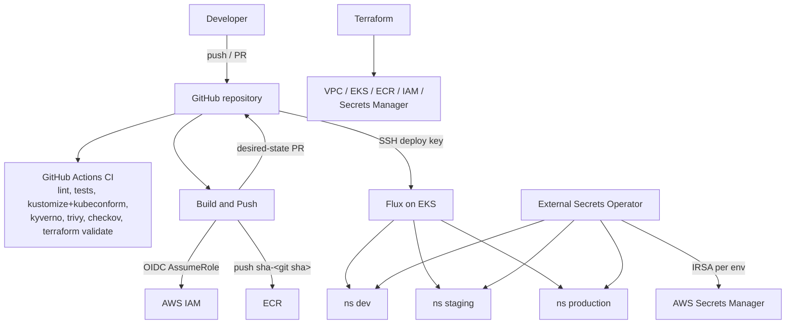

# TeraSky Home Assignment - Kubernetes GitOps on AWS

A small FastAPI backend deployed to EKS across three environments (dev, staging, production) with Flux GitOps, GitHub Actions CI/CD (OIDC, no stored AWS keys), Terraform-managed infrastructure, External Secrets + AWS Secrets Manager, Kyverno policies, and least-privilege RBAC.

**Status: the demo environment is live** (EKS cluster `terasky-demo`, eu-west-1, AWS account `647604014014`). Cleanup instructions are at the bottom.

## 1. Overview

The application exposes:

| Endpoint | Behavior |
|---|---|
| `GET /health` | Liveness/readiness signal; also reports (presence-only) whether the External-Secrets-delivered secret is loaded |
| `GET /nodes` | Lists cluster nodes via the Kubernetes API and marks the node the serving pod runs on (Downward API `spec.nodeName`) |
| `GET /metrics` | Prometheus metrics (`http_requests_total`, `http_request_duration_seconds`) |

Everything the cluster runs is defined in this repository. CI builds and scans an immutable image (`sha-<git sha>`), pushes it to ECR, and opens a pull request that updates the **dev** overlay. Promotion to staging and production moves the **same immutable tag** through PRs (production gated by a GitHub environment approval). Flux reconciles the cluster to Git; nothing in CI ever runs `kubectl`.

## 2. Architecture



Full diagram and walkthrough: [docs/architecture.md](docs/architecture.md)

## 3. Major design decisions

- **GitOps only**: CI's output is an image + a PR. Flux is the only thing that applies to the cluster. ([docs/decisions.md](docs/decisions.md))
- **`spec.replicas` omitted from Deployments**: the HPA owns replica count; a Git-pinned value would make Flux revert every scaling decision.
- **Nodes are cluster-scoped**, so the app's ServiceAccount is bound through a ClusterRole/ClusterRoleBinding with exactly `get`,`list` on `nodes` - a namespaced Role cannot grant this.
- **Per-environment IRSA for secrets**: each namespace's SecretStore can assume only its own IAM role, which can read only `terasky/<env>/backend`.
- **Immutable OIDC subjects**: this GitHub account issues the newer `repo:owner@id/repo@id:...` subject claims; the IAM trust policies accept both exact formats (discovered by debugging a failed AssumeRole, see DD-record in docs/decisions.md).
- **Kyverno in Enforce mode**, scoped strictly to the three app namespaces so policy rollouts can never brick platform controllers.

## 4. Repository structure

```
app/                    FastAPI app, tests, Dockerfile
apps/backend/           Kustomize base + dev/staging/production overlays
clusters/demo/          Flux entry point (flux-system, infrastructure, applications)
infrastructure/         Flux-managed platform: metrics-server, ESO, Kyverno (Helm)
infra/terraform/        VPC, EKS, ECR, IAM (OIDC + IRSA), Secrets Manager
policies/               Kyverno ClusterPolicies + CLI tests (good/bad fixtures)
monitoring/             Example PrometheusRule alerts + design pointer
scripts/                bootstrap-state.sh, promote.sh, verify.sh, demo.sh
docs/                   Architecture, decisions, trade-offs, runbooks, matrix
.github/workflows/      ci, build-push, promote, terraform
```

## 5. Prerequisites

`aws` (authenticated), `terraform >= 1.5.7`, `kubectl`, `flux`, `docker`, `python3.12`, `gh`. Local checks: `make all`.

## 6. Local validation

```bash
make lint test              # ruff + pytest
make kustomize-build validate   # render overlays + kubeconform
make policy-test            # kyverno CLI tests against good/bad fixtures
make tf-fmt tf-validate
```

## 7. Terraform deployment

```bash
./scripts/bootstrap-state.sh                 # one-time: S3 state bucket + DynamoDB lock
terraform -chdir=infra/terraform init
terraform -chdir=infra/terraform plan
terraform -chdir=infra/terraform apply       # ~15 min (EKS)
aws eks update-kubeconfig --region eu-west-1 --name terasky-demo
```

Ongoing changes go through `.github/workflows/terraform.yml`: plan on PRs, apply behind the `production` environment approval.

## 8. Flux bootstrap

```bash
GITHUB_TOKEN=$(gh auth token) flux bootstrap github \
  --owner=NajeebShhadeTasks --repository=terasky-home-assignment \
  --branch=main --path=clusters/demo --personal --token-auth=false
```

`--token-auth=false` stores an SSH **deploy key** in the cluster, not the PAT. Flux then converges: controllers (metrics-server, ESO, Kyverno) -> policies -> the three app environments.

## 9. CI/CD flow

1. PR / push -> **CI**: ruff, pytest, docker build, terraform fmt+validate, kustomize render + kubeconform (with CRD schemas), Kyverno tests, Trivy (HIGH/CRITICAL fail), Checkov.
2. Merge to `main` touching `app/**` -> **Build and Push**: tests -> OIDC AssumeRole (`terasky-demo-gha-ecr`) -> build -> Trivy image scan -> push immutable `sha-<sha>` -> PR updating the dev overlay.
3. Merge that PR -> Flux deploys to dev. No workflow ever contacts the cluster.

Known limitation (documented in [docs/tradeoffs.md](docs/tradeoffs.md)): PRs opened with the workflow `GITHUB_TOKEN` do not trigger CI runs; the solo-maintainer flow is admin review + merge, the production fix is a GitHub App token.

## 10. Promotion

```bash
gh workflow run promote.yml -f target_environment=staging -f image_tag=sha-<sha>
gh workflow run promote.yml -f target_environment=production -f image_tag=sha-<sha>  # requires environment approval
# or locally: ./scripts/promote.sh staging sha-<sha>
```

The workflow refuses any tag the source environment is not currently running (dev -> staging -> production chain), then opens a PR. The image is **never rebuilt** between environments.

## 11. Rollback

```bash
git revert <promotion commit> && git push   # Flux reconciles the previous known-good tag
```

`kubectl set image` is break-glass only; if ever used, Git must immediately be reconciled to match reality. See [docs/demo.md](docs/demo.md#rollback).

## 12. Secrets

Secrets Manager paths `terasky/{dev,staging,production}/backend` (containers by Terraform, **values only via CLI**, never in Git/state). ESO syncs them to Kubernetes Secrets via per-namespace SecretStores using per-environment IRSA roles. Full chain: [docs/secrets.md](docs/secrets.md).

## 13. Policy as code

Six Kyverno ClusterPolicies (Enforce, app namespaces only): non-root, no privilege escalation/privileged, resources required, probes required, no `latest`/untagged images, ECR-registry-only. Tested in CI with `kyverno test` against compliant and violating fixtures. Namespaces additionally carry PSA `restricted` labels.

## 14. Monitoring and logging

The app exposes `/metrics` (live). The full stack (Prometheus/Grafana/Alertmanager, Fluent Bit -> CloudWatch, OpenTelemetry) is a documented design with six example alerts: [docs/monitoring.md](docs/monitoring.md), [monitoring/alerts/](monitoring/alerts/).

## 15. Production AWS design

[docs/aws-production-design.md](docs/aws-production-design.md) - per-topic "Demo vs Production", covering account separation, private endpoints, NAT/endpoints, Karpenter, backup/DR (RTO/RPO), encryption, cost.

## 16. 5-Minute Interview Demo

```bash
aws eks update-kubeconfig --region eu-west-1 --name terasky-demo

# 1. Cluster + GitOps state
kubectl get nodes
flux get kustomizations -A

# 2. The app, everywhere
kubectl get pods -A -l app.kubernetes.io/name=terasky-backend -o wide

# 3. Endpoints
kubectl port-forward -n dev svc/backend 18080:80 &
sleep 3   # give the tunnel a moment
curl -s localhost:18080/health | python3 -m json.tool
curl -s localhost:18080/nodes  | python3 -m json.tool   # currentNode matches -o wide above

# 4. Least-privilege RBAC
kubectl auth can-i list nodes  --as=system:serviceaccount:dev:backend   # yes
kubectl auth can-i delete pods -n dev --as=system:serviceaccount:dev:backend  # no
kubectl auth can-i get secrets -n dev --as=system:serviceaccount:dev:backend  # no

# 5. Drift correction (env-var drift; replicas belong to the HPA - ask me why)
kubectl set env deployment/backend -n dev DRIFT_DEMO=manual-change
flux reconcile kustomization backend-dev --with-source
kubectl get deploy backend -n dev -o jsonpath='{.spec.template.spec.containers[0].env[*].name}'

# 6. Promotion history - same immutable tag through the environments
git log --oneline -8 -- apps/backend/overlays
grep -r newTag apps/backend/overlays/*/kustomization.yaml
```

Guided version: `./scripts/demo.sh`. Full runtime verification: `./scripts/verify.sh`. Runbook with expected outputs: [docs/demo.md](docs/demo.md).

## 17. Assumptions

- One AWS account and one cluster are acceptable for the demo (explicit cost/time vs isolation trade-off; production = per-env accounts and clusters).
- No public DNS zone is available, so ingress ships as a valid manifest + documented ALB design; live access uses port-forward.
- The evaluator has read access to this public repository.

## 18. Trade-offs & 19. Known limitations

Argued honestly in [docs/tradeoffs.md](docs/tradeoffs.md) (public EKS endpoint, single NAT, egress policy shape, single-replica controllers, GITHUB_TOKEN PR limitation, manual rotation, and more).

## 20. Cleanup

```bash
# 1. Destroy the infrastructure (ECR force_delete handles remaining images)
terraform -chdir=infra/terraform destroy

# 2. Remove the state backend (after destroy succeeds).
#    The bucket is VERSIONED, so all object versions must be purged first
#    (`aws s3 rb --force` alone fails with BucketNotEmpty):
aws s3api list-object-versions --bucket terasky-demo-tfstate-647604014014 \
  --query '{Objects: [Versions,DeleteMarkers][][].{Key:Key,VersionId:VersionId}}' \
  --output json > /tmp/state-versions.json
aws s3api delete-objects --bucket terasky-demo-tfstate-647604014014 \
  --delete file:///tmp/state-versions.json
aws s3 rb s3://terasky-demo-tfstate-647604014014
aws dynamodb delete-table --table-name terasky-demo-tf-lock --region eu-west-1

# 3. Delete the interview reviewer IAM user (created outside Terraform):
for k in $(aws iam list-access-keys --user-name terasky-demo-reviewer --query 'AccessKeyMetadata[].AccessKeyId' --output text); do
  aws iam delete-access-key --user-name terasky-demo-reviewer --access-key-id "$k"; done
aws iam delete-user-policy --user-name terasky-demo-reviewer --policy-name terasky-demo-view-only
aws iam delete-user --user-name terasky-demo-reviewer
rm -f ~/terasky-reviewer-credentials.txt

# 4. Optional: remove the Flux deploy key from the GitHub repo settings
#    (Settings -> Deploy keys) and delete CloudWatch log groups /aws/eks/terasky-demo/*
aws logs delete-log-group --log-group-name /aws/eks/terasky-demo/cluster --region eu-west-1
```

Secrets Manager secrets are created with `recovery_window_in_days = 0`, so `terraform destroy` removes them immediately.

## AI usage

AI assistance was used and is disclosed transparently in [docs/AI_USAGE.md](docs/AI_USAGE.md).
