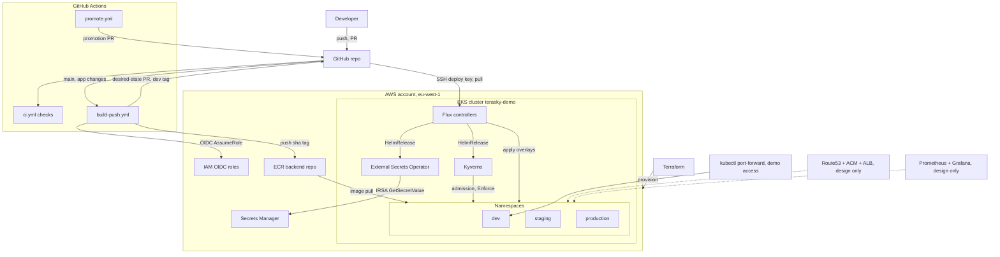

# Architecture

This repository delivers a small FastAPI backend to an EKS cluster (`terasky-demo`, Kubernetes 1.33, eu-west-1, account 647604014014) using a strict GitOps model. Terraform provisions the AWS layer (VPC, EKS, ECR, IAM, Secrets Manager); GitHub Actions builds, scans, and pushes an immutable image to ECR via OIDC (no stored AWS keys) and then expresses every deployment as a pull request against this repository; Flux inside the cluster pulls the merged state and reconciles three environments (`dev`, `staging`, `production`) as namespaces on one cluster. CI/CD never talks to the cluster: no workflow runs `kubectl` or `helm` against it. Kyverno enforces admission policy in the three app namespaces, External Secrets Operator (ESO) delivers per-environment secrets from AWS Secrets Manager via IRSA, and the demo trades a few production defaults (single NAT gateway, public EKS endpoint, one cluster for three environments, no installed ingress controller) for cost and time, with the production alternative documented in each case.

## System diagram

Solid arrows exist in the demo. Dashed arrows are design only: the ALB path ships as a manifest but no ingress controller is installed (see [Ingress](#ingress)), and the monitoring plane is documented but not deployed.

## Component walkthrough

| Path | Purpose |
| --- | --- |
| `app/` | FastAPI service (`/health`, `/nodes`, `/metrics`), pytest suite, multi-stage Dockerfile (non-root uid 10001) |
| `apps/backend/base/` | Kustomize base: ServiceAccounts, RBAC, Deployment, Service, Ingress, HPA, PDB, NetworkPolicy, SecretStore + ExternalSecret, `backend-config` configMapGenerator |
| `apps/backend/overlays/{dev,staging,production}/` | Per-environment namespace, image tag, sizing (HPA, PDB, resources), log level, ingress host, secret path, ESO IAM role annotation |
| `clusters/demo/` | Flux entry point: `flux-system` (bootstrap), `infrastructure.yaml` (platform layer), `applications.yaml` (one Kustomization per environment) |
| `infrastructure/controllers/` | HelmReleases, pinned: metrics-server 3.14.0 (kube-system), external-secrets 2.9.0, kyverno 3.9.0 |
| `infrastructure/configs/` | Applied after controllers; currently points at `policies/kyverno` |
| `policies/kyverno/` | 6 ClusterPolicies in Enforce mode, scoped only to the three app namespaces |
| `policies/tests/` | Kyverno CLI tests (16 assertions) run in CI and locally |
| `infra/terraform/` | VPC, EKS (IRSA, KMS secret encryption, VPC CNI NetworkPolicy agent), ECR (immutable tags, scan-on-push), GitHub OIDC roles, per-environment ESO IAM roles, Secrets Manager containers |
| `.github/workflows/` | `ci.yml` (lint, tests, build, validate, scan), `build-push.yml` (image build and desired-state PR), `promote.yml` (gated promotion PRs), `terraform.yml` (plan on PR, approved apply) |
| `monitoring/alerts/` | Example PrometheusRule alerts, syntactically valid, not deployed |
| `scripts/`, `Makefile` | State bootstrap, promotion helper, runtime verification, guided demo, local quality gates |

## Request flow: GET /nodes

1. A client reaches a backend pod on port 8000. In the demo this is `kubectl port-forward` (which tunnels through the kubelet, so the same-namespace-only NetworkPolicy ingress rule does not block it); in the production design it is the ALB path below.
2. The handler reads its own identity from Downward API environment variables (`NODE_NAME`, `POD_NAME`, `POD_NAMESPACE`) injected by the Deployment.
3. It calls the Kubernetes API using the in-cluster token of the `backend` ServiceAccount. Authorization is a per-environment ClusterRole and ClusterRoleBinding (`terasky-backend-node-reader-<env>`) granting exactly `get` and `list` on `nodes`, nothing else. A ClusterRole is required because nodes are cluster-scoped, which a namespaced Role cannot grant; the per-environment rename exists because cluster-scoped names must be unique when three overlays install the same base.
4. The response is shaped to safe fields only (`name`, `ready`, `current`, `kubeletVersion`, `architecture`, `os`), and the pod's own node is marked `current: true` by comparing each node name to `NODE_NAME`.
5. If the Kubernetes API is unreachable, the endpoint returns 503 with an error body. The health probes are unaffected by design: `/health` deliberately does not touch the Kubernetes API, so a control-plane hiccup cannot make every replica unready at once.

The NetworkPolicy egress rule (DNS plus TCP/443 anywhere) is what allows step 3: the EKS API endpoint has no stable, portable CIDR, so 443 stays open to any address while every other port is closed.

## Reconciliation flow

Flux was bootstrapped with `flux bootstrap github --path clusters/demo --token-auth=false`, so the cluster authenticates to GitHub with an SSH deploy key (no PAT stored in the cluster).

1. The `flux-system` GitRepository pulls this repo.
2. `infra-controllers` (interval 10m, `wait: true`) installs metrics-server, ESO, and Kyverno as pinned HelmReleases.
3. `infra-configs` (`dependsOn: infra-controllers`) applies the Kyverno ClusterPolicies, which need the CRDs from step 2.
4. `backend-dev`, `backend-staging`, and `backend-production` (interval 5m, `dependsOn: infra-configs`, `prune: true`, `wait: true`) each build one overlay and apply it. `prune: true` means deleting something from Git deletes it from the cluster; Git is the single source of truth.

Two consequences worth calling out:

- **Replica ownership.** The Deployment omits `spec.replicas` because the HPA owns replica count. If the manifest pinned a count, every Flux reconcile would revert HPA scaling and the two controllers would fight. This is also why the drift demo changes an environment variable (`kubectl set env`, reverted by Flux within an interval) rather than `kubectl scale`, which the HPA would correct first and muddy the story.
- **Image delivery is a PR, never a push to the cluster.** `build-push.yml` builds and scans `sha-<7-char git sha>`, pushes it to ECR (immutable tags), and opens a PR that runs `kustomize edit set image` on the dev overlay. Merging that PR is the deployment; Flux applies it on its next reconcile. `promote.yml` copies the same immutable tag to staging and then production (chain enforced: staging from dev, production from staging; production behind a required-reviewer GitHub environment). Rollback is `git revert` of the promotion commit; `kubectl set image` is break-glass only and must be followed by re-reconciling Git.

## Ingress

The base ships a complete Ingress manifest (`ingressClassName: alb`, internet-facing, `target-type: ip`, health check on `/health`, HTTPS listener, per-environment hosts `backend.dev.terasky-demo.example.com`, `backend.staging.terasky-demo.example.com`, `backend.terasky-demo.example.com`; the ACM certificate ARN is intentionally omitted so the controller discovers it by hostname).

**Demo trade-off:** the AWS Load Balancer Controller is not installed. There is no real domain for this assignment, and installing a controller that could never publish a working ALB was cut for time. The Ingress applies cleanly and simply never receives an address; live access is `kubectl port-forward`, which works regardless because it tunnels through the kubelet.

**Production design:** Route53 record, ACM certificate, ALB provisioned by the AWS Load Balancer Controller, Service, Pods. The groundwork already exists: Terraform tags the public subnets with `kubernetes.io/role/elb` and the private subnets with `kubernetes.io/role/internal-elb` for controller subnet discovery, and the manifest is written for it. Turning it on means adding a pinned HelmRelease for the controller under `infrastructure/controllers/` with an IRSA role, plus a real hosted zone and certificate.

## Monitoring plane (design only)

Nothing in the monitoring plane is deployed; the app already exposes what it needs (`/metrics` with `http_requests_total` and `http_request_duration_seconds` via prometheus-client). The design is kube-prometheus-stack (Prometheus, kube-state-metrics, node-exporter, Grafana, Alertmanager) or CloudWatch Container Insights, Fluent Bit to CloudWatch for logs, and OpenTelemetry for traces. `monitoring/alerts/backend-alerts.yaml` holds six example PrometheusRule alerts (5xx rate, crashloop, unavailable replicas, HPA at max, CPU near limit, node pressure); they are syntactically valid but not applied, since no Prometheus runs on the demo cluster.
