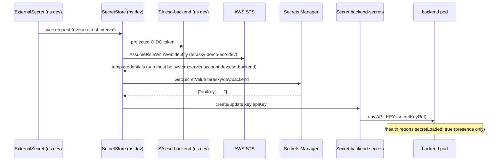

# Secrets Management

Secrets live in AWS Secrets Manager and are synced into Kubernetes by External Secrets Operator (ESO) over per-environment IRSA roles. Secret values never appear in Git, in Terraform state, or in CI logs. The full chain is auditable end to end: one secret path, one IAM role, one namespace per environment.

## Where secrets live

One Secrets Manager secret per environment, created by Terraform (`infra/terraform/secrets.tf`):

| Environment | Secret path | Consuming namespace |
|---|---|---|
| dev | `terasky/dev/backend` | `dev` |
| staging | `terasky/staging/backend` | `staging` |
| production | `terasky/production/backend` | `production` |

The secret value is a JSON object; the app currently uses one key, `apiKey`.

Demo trade-off: the secrets are created with `recovery_window_in_days = 0` so `terraform destroy` cleans up immediately. Production would keep the default 30-day recovery window.

## Containers vs. values

Terraform creates only the secret **containers** (name, description, tags). It never writes a **value**, because any value passed to Terraform ends up in plan output and in the state file, and the code that sets it would sit in Git. Values are set out-of-band by an operator with an authenticated CLI call:

```bash
aws secretsmanager put-secret-value \
  --secret-id terasky/dev/backend \
  --secret-string '{"apiKey":"<value>"}'
```

Result: Git and Terraform state describe *that* a secret exists and *who* may read it, never *what* it contains.

## How ESO gets access (the IRSA chain)

Each namespace runs its own `SecretStore` named `aws-secrets-manager` (`apps/backend/base/externalsecret.yaml`). The chain from Kubernetes object to AWS permission:

1. The `SecretStore` authenticates with `auth.jwt.serviceAccountRef: eso-backend`, the `eso-backend` ServiceAccount in the same namespace.
2. That ServiceAccount carries an `eks.amazonaws.com/role-arn` annotation, patched per overlay to the environment's role, e.g. `arn:aws:iam::647604014014:role/terasky-demo-eso-dev`.
3. The role's trust policy (`infra/terraform/iam-eso.tf`) accepts only the cluster's OIDC provider with `sub` equal to `system:serviceaccount:<env>:eso-backend` (and `aud` `sts.amazonaws.com`). No other ServiceAccount, in any namespace, can assume it.
4. The role's inline policy allows exactly two actions on exactly one resource: that environment's secret ARN.

So ESO in the `dev` namespace can read `terasky/dev/backend` and nothing else; same pattern for staging and production.

## How the workload consumes the secret

An `ExternalSecret` named `backend` references the `SecretStore` and materializes a Kubernetes `Secret` called `backend-secrets` with key `apiKey` (creationPolicy `Owner`, so ESO manages its lifecycle). The Deployment injects it as the `API_KEY` environment variable via `secretKeyRef`.

`GET /health` returns `"secretLoaded": true|false`, a presence-only boolean (`bool(os.getenv("API_KEY"))` in `app/src/main.py`). It proves the entire chain worked without ever exposing the value.

### Sync path



## Environment separation

Per environment: its own secret path, its own IAM role, its own `eso-backend` ServiceAccount, its own `SecretStore`. The overlays patch three things: the SA's role-arn annotation, the `remoteRef.key`, and (dev only) the refresh interval.

A namespaced `SecretStore` was chosen over a `ClusterSecretStore` deliberately. A `ClusterSecretStore` is a single cluster-wide credential boundary: any namespace that can reference it inherits its access, and separating environments then depends on ESO-level allow-lists instead of IAM. With namespaced stores the boundary is enforced by AWS: the trust policy's `sub` condition binds each role to one namespace's ServiceAccount, so a compromise of the dev namespace cannot reach staging or production secret material.

## Least privilege

The ESO role policy grants exactly:

- `secretsmanager:GetSecretValue`
- `secretsmanager:DescribeSecret`

scoped to the single ARN of that environment's secret. No `List*`, no wildcard resource, no write or delete actions. The workload's own ServiceAccount (`backend`) has no AWS access at all; only `eso-backend` talks to AWS, and only to fetch.

## Rotation

Rotation is "change the value in Secrets Manager, wait for ESO to re-sync":

1. `aws secretsmanager put-secret-value --secret-id terasky/dev/backend --secret-string '{"apiKey":"<new-value>"}'`
2. On the next refresh, ESO updates `backend-secrets`.

The dev overlay sets `refreshInterval: 1m` specifically so rotation is demonstrable live; staging and production use the base `1h`.

Demo trade-off: rotation is manual here. Production would drive it with Secrets Manager rotation Lambdas or external automation on a schedule, keeping the same ESO sync path.

Application requirement: because the secret is injected as an environment variable, running pods keep the old value until restarted. The app (and its consumers) must tolerate a re-read or rolling restart after rotation; an overlap window in which both old and new credentials are valid makes this a zero-downtime operation. Mounting the Secret as a file that the app re-reads is the alternative if restarts are unacceptable.

## Deliberately not done, and why

- **No secret values in Terraform.** `aws_secretsmanager_secret_version` would put plaintext into plan output and state. State lives in S3; treating it as a secret store widens the blast radius of every state read.
- **No SOPS or sealed-secrets.** Both keep (encrypted) secret material in Git. ESO was chosen instead because values stay out of Git entirely, Secrets Manager remains the single source of truth (one place to audit, one place to rotate), and rotation propagates through the existing sync loop with no re-encrypt/re-commit step. SOPS/sealed-secrets are reasonable where no external secret store exists; here one does.
- **No CI/CD access to secret values.** Pipelines never read or write secrets; only the out-of-band operator call sets values, and only ESO inside the cluster reads them.
